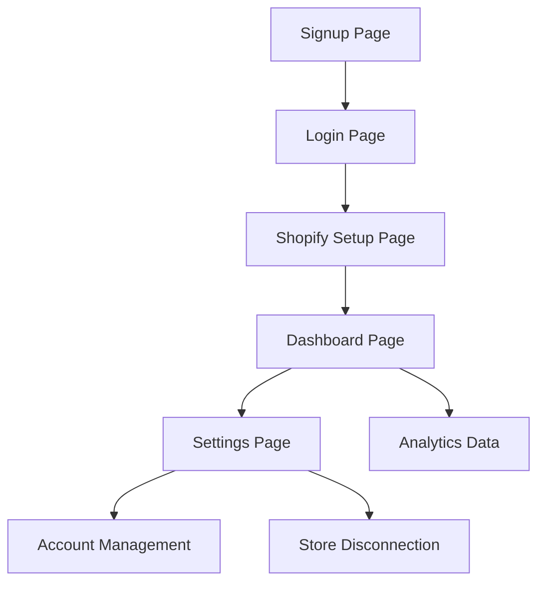

## 1. Product Overview
A comprehensive e-commerce analytics dashboard that connects to users' Shopify stores via API, providing personalized sales insights, order tracking, and business metrics. Users authenticate with email/password, connect their Shopify credentials, and access a secure dashboard displaying their store's performance data.

Target audience: E-commerce business owners and managers who need centralized analytics for their Shopify stores.

## 2. Core Features

### 2.1 User Roles
| Role | Registration Method | Core Permissions |
|------|---------------------|------------------|
| Store Owner | Email registration with password | Full dashboard access, Shopify connection, analytics viewing, API key management |

### 2.2 Feature Module
The e-commerce dashboard consists of the following main pages:
1. **Login page**: User authentication, password reset option.
2. **Signup page**: Email registration with password creation.
3. **Dashboard page**: Analytics overview, order metrics, sales charts, product performance.
4. **Setup page**: Shopify API credentials input, connection status.
5. **Settings page**: API key management, account settings, store disconnection.

### 2.3 Page Details
| Page Name | Module Name | Feature description |
|-----------|-------------|---------------------|
| Login page | Authentication form | Enter email and password to access dashboard. Includes password reset link. |
| Login page | Error handling | Display authentication errors and validation messages. |
| Signup page | Registration form | Create account with email and password. Validate email format and password strength. |
| Signup page | Account creation | Create user record in Supabase with secure password hashing. |
| Dashboard page | Analytics overview | Display total sales, order count, average order value, conversion rate. |
| Dashboard page | Daily metrics | Show daily order counts with trend indicators and date range selection. |
| Dashboard page | Sales charts | Visualize sales trends with line charts and bar graphs for different time periods. |
| Dashboard page | Product performance | List top-selling products with revenue and quantity sold. |
| Dashboard page | Recent orders | Display latest orders with customer info, products, and order status. |
| Setup page | Shopify connection | Input store URL, API key, and API secret for Shopify integration. |
| Setup page | Connection validation | Test Shopify credentials and verify store access. |
| Setup page | Data sync | Pull historical orders and product data from connected Shopify store. |
| Settings page | API key management | Generate and view personal API key for external integrations. |
| Settings page | Store settings | View connected store information and disconnect option. |
| Settings page | Account settings | Update password and view account details. |

## 3. Core Process
User registration and onboarding flow: User visits signup page → Creates account with email/password → Redirects to login → Enters credentials → Redirects to Shopify setup page → Inputs Shopify API credentials → System validates and connects store → Redirects to personalized dashboard → Dashboard fetches and displays store analytics.

Regular user flow: User logs in → Lands on dashboard → Views analytics and metrics → Can access settings to manage account or disconnect store.

## 4. User Interface Design

### 4.1 Design Style
- Primary colors: Professional blue (#2563eb) for primary actions, white background
- Secondary colors: Gray (#6b7280) for secondary text, green (#10b981) for positive metrics, red (#ef4444) for negative trends
- Button style: Rounded corners (8px radius), clear hover states, consistent sizing
- Font: System fonts (Inter, -apple-system, BlinkMacSystemFont), 14-16px for body text, 18-24px for headings
- Layout style: Card-based dashboard with sidebar navigation, responsive grid system
- Icons: Minimal line icons for navigation and metrics, consistent stroke width

### 4.2 Page Design Overview
| Page Name | Module Name | UI Elements |
|-----------|-------------|-------------|
| Login page | Authentication form | Centered card layout, input fields with labels, primary blue submit button, password visibility toggle. |
| Signup page | Registration form | Similar to login with additional password confirmation field, strength indicator. |
| Dashboard page | Analytics overview | Grid of metric cards showing key performance indicators with percentage changes. |
| Dashboard page | Sales charts | Full-width line chart for revenue trends, bar chart for product categories. |
| Dashboard page | Recent orders | Table with sortable columns, status badges, pagination for large datasets. |
| Setup page | Shopify connection | Form with store URL input, API key fields, connection test button, progress indicator. |
| Settings page | API management | Secure API key display with copy button, regeneration option. |

### 4.3 Responsiveness
Desktop-first design approach with mobile adaptation. Dashboard collapses to mobile-friendly layout with hamburger menu for navigation. Charts and tables adapt to smaller screens with touch-friendly interactions. Minimum supported width: 320px for mobile devices.