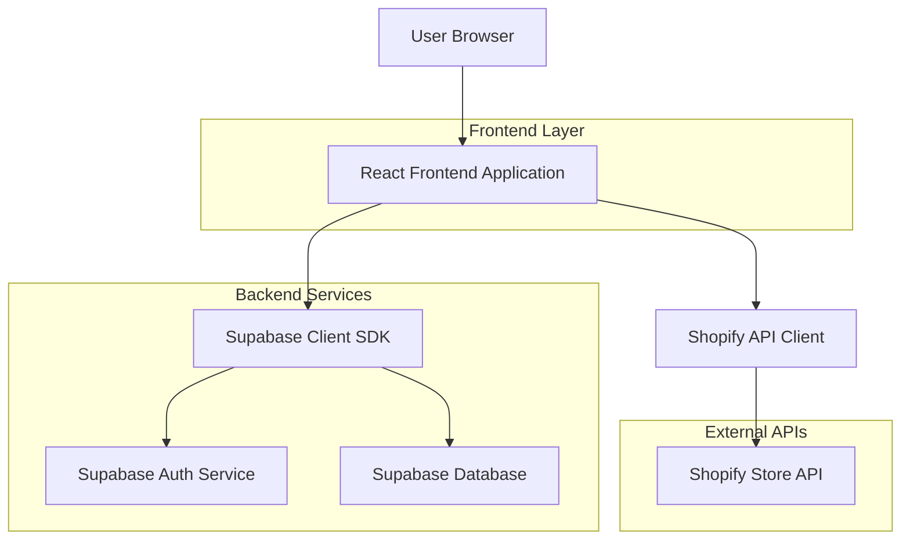
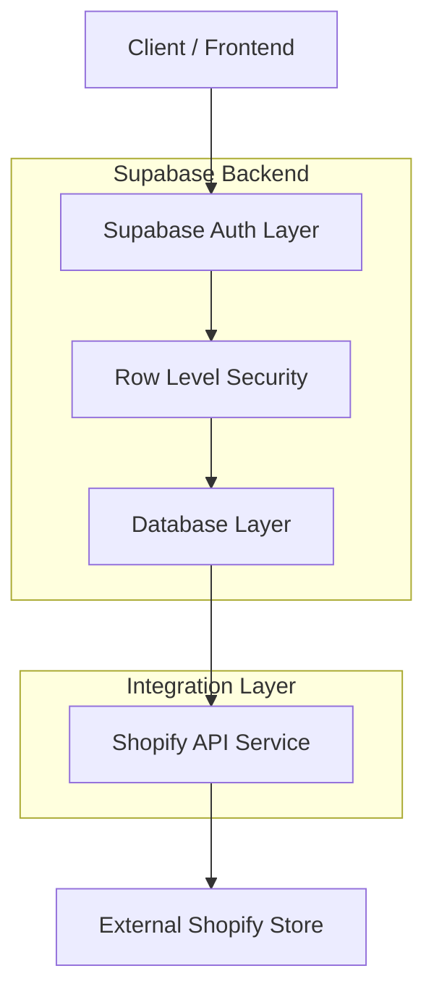
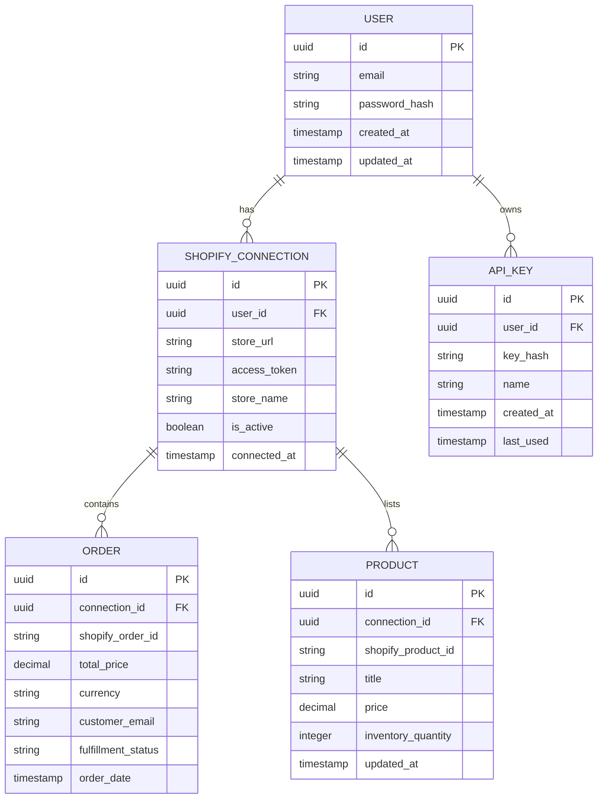

## 1. Architecture design



## 2. Technology Description
- Frontend: React@18 + tailwindcss@3 + vite
- Initialization Tool: vite-init
- Backend: Supabase (Authentication + PostgreSQL Database)
- External Integration: Shopify Admin API

## 3. Route definitions
| Route | Purpose |
|-------|---------|
| / | Login page, user authentication entry point |
| /signup | Registration page for new users |
| /dashboard | Main analytics dashboard with store metrics |
| /setup | Shopify connection setup and configuration |
| /settings | User account and API key management |

## 4. API definitions

### 4.1 Authentication APIs

User registration
```
POST /auth/v1/signup
```

Request:
| Param Name| Param Type  | isRequired  | Description |
|-----------|-------------|-------------|-------------|
| email     | string      | true        | User email address |
| password  | string      | true        | User password (min 6 characters) |

Response:
| Param Name| Param Type  | Description |
|-----------|-------------|-------------|
| user      | object      | User object with id and email |
| session   | object      | Authentication session tokens |

### 4.2 Shopify Integration APIs

Connect Shopify store
```
POST /rest/shopify/connect
```

Request:
| Param Name| Param Type  | isRequired  | Description |
|-----------|-------------|-------------|-------------|
| store_url | string      | true        | Shopify store URL (myshop.myshopify.com) |
| api_key   | string      | true        | Shopify API key |
| api_secret| string      | true        | Shopify API secret |

Response:
| Param Name| Param Type  | Description |
|-----------|-------------|-------------|
| connected | boolean     | Connection status |
| store_name| string      | Verified store name |

### 4.3 Analytics APIs

Get dashboard metrics
```
GET /rest/analytics/metrics
```

Response:
| Param Name| Param Type  | Description |
|-----------|-------------|-------------|
| total_sales     | number | Total sales amount |
| order_count     | number | Total number of orders |
| avg_order_value | number | Average order value |
| conversion_rate | number | Store conversion rate |

## 5. Server architecture diagram



## 6. Data model

### 6.1 Data model definition


### 6.2 Data Definition Language

User Table (users)
```sql
-- create table
CREATE TABLE users (
  id UUID PRIMARY KEY DEFAULT gen_random_uuid(),
  email VARCHAR(255) UNIQUE NOT NULL,
  password_hash VARCHAR(255) NOT NULL,
  created_at TIMESTAMP WITH TIME ZONE DEFAULT NOW(),
  updated_at TIMESTAMP WITH TIME ZONE DEFAULT NOW()
);

-- enable RLS
ALTER TABLE users ENABLE ROW LEVEL SECURITY;

-- create policies
CREATE POLICY "Users can view own profile" ON users FOR SELECT USING (auth.uid() = id);
CREATE POLICY "Users can update own profile" ON users FOR UPDATE USING (auth.uid() = id);

-- grant permissions
GRANT SELECT ON users TO authenticated;
GRANT UPDATE ON users TO authenticated;
```

Shopify Connections Table (shopify_connections)
```sql
-- create table
CREATE TABLE shopify_connections (
  id UUID PRIMARY KEY DEFAULT gen_random_uuid(),
  user_id UUID NOT NULL REFERENCES users(id) ON DELETE CASCADE,
  store_url VARCHAR(255) NOT NULL,
  access_token VARCHAR(500) NOT NULL,
  store_name VARCHAR(255),
  is_active BOOLEAN DEFAULT true,
  connected_at TIMESTAMP WITH TIME ZONE DEFAULT NOW(),
  created_at TIMESTAMP WITH TIME ZONE DEFAULT NOW(),
  updated_at TIMESTAMP WITH TIME ZONE DEFAULT NOW()
);

-- enable RLS
ALTER TABLE shopify_connections ENABLE ROW LEVEL SECURITY;

-- create policies
CREATE POLICY "Users can view own connections" ON shopify_connections FOR SELECT USING (auth.uid() = user_id);
CREATE POLICY "Users can create own connections" ON shopify_connections FOR INSERT WITH CHECK (auth.uid() = user_id);
CREATE POLICY "Users can update own connections" ON shopify_connections FOR UPDATE USING (auth.uid() = user_id);

-- grant permissions
GRANT ALL ON shopify_connections TO authenticated;
```

Orders Table (orders)
```sql
-- create table
CREATE TABLE orders (
  id UUID PRIMARY KEY DEFAULT gen_random_uuid(),
  connection_id UUID NOT NULL REFERENCES shopify_connections(id) ON DELETE CASCADE,
  shopify_order_id VARCHAR(100) NOT NULL,
  total_price DECIMAL(10,2) NOT NULL,
  currency VARCHAR(3) DEFAULT 'USD',
  customer_email VARCHAR(255),
  fulfillment_status VARCHAR(50),
  order_date TIMESTAMP WITH TIME ZONE,
  created_at TIMESTAMP WITH TIME ZONE DEFAULT NOW(),
  UNIQUE(connection_id, shopify_order_id)
);

-- enable RLS
ALTER TABLE orders ENABLE ROW LEVEL SECURITY;

-- create policies
CREATE POLICY "Users can view own orders" ON orders FOR SELECT USING (
  EXISTS (
    SELECT 1 FROM shopify_connections 
    WHERE shopify_connections.id = orders.connection_id 
    AND shopify_connections.user_id = auth.uid()
  )
);

-- grant permissions
GRANT SELECT ON orders TO authenticated;

-- create indexes
CREATE INDEX idx_orders_connection_id ON orders(connection_id);
CREATE INDEX idx_orders_order_date ON orders(order_date DESC);
```

Products Table (products)
```sql
-- create table
CREATE TABLE products (
  id UUID PRIMARY KEY DEFAULT gen_random_uuid(),
  connection_id UUID NOT NULL REFERENCES shopify_connections(id) ON DELETE CASCADE,
  shopify_product_id VARCHAR(100) NOT NULL,
  title VARCHAR(500) NOT NULL,
  price DECIMAL(10,2),
  inventory_quantity INTEGER DEFAULT 0,
  updated_at TIMESTAMP WITH TIME ZONE,
  created_at TIMESTAMP WITH TIME ZONE DEFAULT NOW(),
  UNIQUE(connection_id, shopify_product_id)
);

-- enable RLS
ALTER TABLE products ENABLE ROW LEVEL SECURITY;

-- create policies
CREATE POLICY "Users can view own products" ON products FOR SELECT USING (
  EXISTS (
    SELECT 1 FROM shopify_connections 
    WHERE shopify_connections.id = products.connection_id 
    AND shopify_connections.user_id = auth.uid()
  )
);

-- grant permissions
GRANT SELECT ON products TO authenticated;

-- create indexes
CREATE INDEX idx_products_connection_id ON products(connection_id);
```

API Keys Table (api_keys)
```sql
-- create table
CREATE TABLE api_keys (
  id UUID PRIMARY KEY DEFAULT gen_random_uuid(),
  user_id UUID NOT NULL REFERENCES users(id) ON DELETE CASCADE,
  key_hash VARCHAR(255) NOT NULL,
  name VARCHAR(100),
  created_at TIMESTAMP WITH TIME ZONE DEFAULT NOW(),
  last_used TIMESTAMP WITH TIME ZONE
);

-- enable RLS
ALTER TABLE api_keys ENABLE ROW LEVEL SECURITY;

-- create policies
CREATE POLICY "Users can manage own API keys" ON api_keys FOR ALL USING (auth.uid() = user_id);

-- grant permissions
GRANT ALL ON api_keys TO authenticated;
```